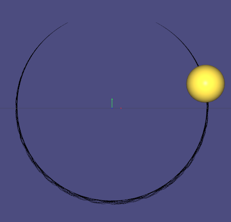

## 2.1
- 实现效果
  

- 为什么会有逐渐向外偏离的倾向？我采用的是半隐式欧拉方法，为一阶精度，仿真过程中的误差累积导致出现向外偏离。下面详细分析为什么是向外偏离：
  - 直观理解：这种基于力的约束形式用约束力来补偿小球法向上的移动倾向，使得小球尽可能沿切向运动，实际每一帧更新时，不论使用哪一种方法，使用当前速度（显式欧拉），下一帧速度（半隐式欧拉）或中点速度（中点法或RK方法等），小球会沿切线方向更新位置，所以会有向外偏离的倾向。
  - 公式推理：半隐式欧拉的位置更新公式为：
    $$
    \begin{aligned}
    x(t+h)
    &=x(t)+h\dot x(t+h) \\
    &=x(t)+h(\dot x(t)+h\ddot x(t))
    \end{aligned}
    $$
    截断误差为
    $$
    \hat x(t+h)-x(t+h)=-\frac{h^2}{2}\ddot x(t)+O(h^3)
    $$
    $\ddot x(t)$在法向上的分量指向圆心，那么法向上的误差法向指向外侧，因此表现为逐渐向外偏离

- 解决方法：
  1. 在法向上加一个弹性系数较大的弹簧约束，弹簧原长为环半径$r$，法向力增加的项为：
    $\tilde f_N = -k(x - \frac{x}{|x|}r)$，约束力合力变为：$\tilde f=\lambda x+\tilde f_N$，仍然用半隐式欧拉方法更新位置和速度，可以获得比较可观的效果，如下图所示：
    
    但在圆环底部由于速度较大，也会有一定的偏移，这种方法并不能很好地避免
  2. 直接对速度加一定的偏移量，使得位置更新结果保持在圆环上
  3. 改用基于位置的约束方法

# 3.1
- 实现效果：线性求解器使用ldlt
  

- 添加feedback：根据文档提示，令$k_s=0.1$，$k_d=0.1$，可以获得如下的效果：
  

- 和前一个场景类似，添加的关于$C$的反馈类似于弹簧约束，当物体偏离约束时，施加一个与偏离约束方向相反的约束项将物体拉回，添加的关于$\dot C$的反馈则可以使得偏离约束的速度不至于增大。