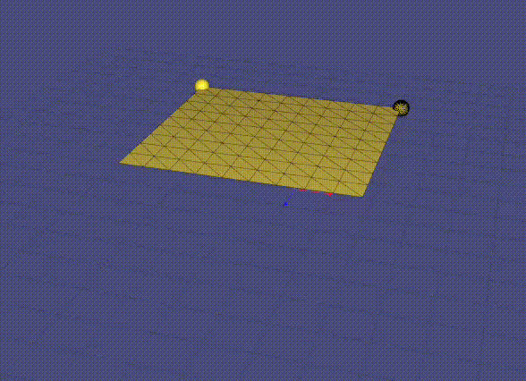

## 0. 实现效果
以下均为默认参数、时间步长为0.01时的运行效果。

显式欧拉：

隐式欧拉：

半隐式欧拉：

一半时间隐式，一半时间显式：（实现为一帧隐式一帧显式交替）：

## 1. 隐式欧拉的实现

隐式欧拉：
$$x_{t+1}=x_t+hf(x_{t+1})$$
直接求解不太方便，可以进行一定形式的替换：
$$x_{t+1}-x_t=hf(x_{t+1})$$
$$\downarrow$$
$$\Delta x=hf(x_t+\Delta x)$$
用一阶泰勒来估计$f(x_t+\Delta x)$：
$$
\Delta x=h(f(x_t)+f'(x_t)\Delta x)
$$
这里引入的二阶误差，相比显式欧拉造成的不稳定性，可以接受。

对于布料的弹簧质点模型，先求速度：
$$v_{n+1}=v_n+\Delta t\frac{f_{n+1}}{m}$$
其中$f_{n+1}$是后一帧的弹簧力，但现在无法直接求，将弹簧力表示为关于位置$x$和速度$v$的函数$f(x,v)$，则有：
$$f'(x_a,v_a,x_b,v_b)=\frac{\partial f}{\partial x_a}\Delta x_a+\frac{\partial f}{\partial v_a}\Delta v_a+\frac{\partial f}{\partial x_b}\Delta x_b+\frac{\partial f}{\partial v_b}\Delta v_b$$
$$
\begin{aligned}
\Delta v_a &=\frac{\Delta t}{m}f_{n+1} \\
&= \frac{\Delta t}{m}(f_n+\frac{\partial f}{\partial x_a}\Delta x_a+\frac{\partial f}{\partial v_a}\Delta v_a+\frac{\partial f}{\partial x_b}\Delta x_b+\frac{\partial f}{\partial v_b}\Delta v_b) \\
&= \frac{\Delta t}{m}(f_n+\frac{\partial f}{\partial x_a}v_{a,n+1}\Delta t+\frac{\partial f}{\partial v_a}\Delta v_a+\frac{\partial f}{\partial x_b}v_{b,n+1}\Delta t+\frac{\partial f}{\partial v_b}\Delta v_b) \\
&= \frac{\Delta t}{m}(f_n+\frac{\partial f}{\partial x_a}(v_a+\Delta v_a)\Delta t+\frac{\partial f}{\partial v_a}\Delta v_a+\frac{\partial f}{\partial x_b}(v_b+\Delta v_b)\Delta t+\frac{\partial f}{\partial v_b}\Delta v_b)
\end{aligned}
$$
接下来，除$\Delta v_a$和$\Delta v_b$外都是已知量，化简得到：
$$
(m-\Delta t\frac{\partial f}{\partial v_a}-{\Delta t}^2\frac{\partial f}{\partial x_a})\Delta v_a-(\Delta t\frac{\partial f}{\partial v_b}+{\Delta t}^2\frac{\partial f}{\partial x_b})\Delta v_b=\Delta t(f_n+\Delta t(\frac{\partial f}{\partial x_a}v_a+\frac{\partial f}{\partial x_b}v_b))
$$
整理矩阵方程：需要求的是各个质点的速度变化量$x=[\Delta v_1,\Delta v_2,...,\Delta v_n]^T$，等式左侧$\Delta v_a$的系数位于矩阵$A$的$(a,a)$处，$\Delta v_b$的系数位于矩阵$A$的$(a,b)$处，等式右侧位于$b$中的$(a)$处，系数矩阵A类似雅可比矩阵：
$$Ax=b$$

最后使用隐式欧拉方法更新：
$$
v_{n+1}=v_n+\Delta v \\
x_{n+1}=x_n+\Delta tv_{n+1}
$$

对于structure、bending、shearing三个应力，
$$f_a=k(L-||p_a-p_b||)\hat p_{ab}$$
$$
\frac{\partial f_a}{\partial p_a}=k(-\hat p_{ab}\hat p_{ab}^T+(L-||p_{a}-p_{b}||)\frac{I-\hat p_{ab}\hat p_{ab}^T}{||p_a-p_b||})=-\frac{\partial f_a}{\partial p_b}
$$
$$
\frac{\partial f_a}{\partial v_a}=\frac{\partial f_a}{\partial v_b}=0
$$
对于阻尼力，
$$f_{da}=k_d((v_b-v_a)\cdot \hat p_{ab})\hat p_{ab}$$
$$
\frac{\partial f_{da}}{\partial p_a}=k_d((v_b-v_a)\cdot \hat p_{ab})\frac{I-\hat p_{ab}\hat p_{ab}^T}{||p_a-p_b||}+k_d\frac{I-\hat p_{ab}\hat p_{ab}^T}{||p_a-p_b||}(v_b-v_a)\hat p_{ab}^T
=-\frac{\partial f_{da}}{\partial p_b}
$$
$$
\frac{\partial f_{da}}{\partial v_a}=-k_d\hat p_{ab}\hat p_{ab}^T=-\frac{\partial f_{da}}{\partial v_b}
$$

## 2. 稳定性和性能对比
稳定性：在相同步长（0.01）的情况下，显式欧拉的稳定性明显弱于其他几种方法，在正常运行一小段时间后由于误差积累，导致求解发散；隐式欧拉、半隐式欧拉和混合方法都能保持稳定。

性能：在相同步长（0.001）的情况下，显式欧拉和半隐式欧拉的平均帧时间为6ms左右，混合方法的平均帧时间为8ms左右，隐式欧拉的平均帧时间为10ms，由于需要使用矩阵来求解线性方程组，时间开销较大。

## 3. 与地面的碰撞和摩擦
与地面（$y=0$）的碰撞：根据配置的恢复系数，当布料质点位于$y=0$平面下方时，将$y$方向上的速度反向并乘以恢复系数$r$，这种简单的方式即可模拟比较理想的碰撞和反弹效果。为保持稳定的接触条件，需要将地面下方的质点位置设为$y=-\epsilon$，$\epsilon$是一个误差允许值比如$1e-6$

与地面的摩擦：当布料质点和地面的碰撞发生时，根据速度变化求出质点受到的冲量，进而求出质点所受的正压力，乘以$\mu$即为所受的摩擦力。在隐式欧拉方法中，摩擦力关于速度的偏导为：
$$\frac{\partial f_{friction}}{\partial v_a}=\frac{\partial ||f_{friction}||}{\partial v_a}\hat f_{friction}^T+||f_{friction}||\frac{\partial \hat f_{friction}}{\partial v_a}$$
其中
$$
\frac{\partial ||f_{friction}||}{\partial v_a}=[0,\mu(1+r)\frac{m}{\Delta t},0]^T \\
\frac{\partial \hat f_{friction}}{\partial v_a}=
\left[
\begin{matrix}
\frac{||f_f||-\frac{v_x^2}{||f_f||}}{||f_f||^2} & 0 & -\frac{v_xv_z}{||f_f||^3} \\
0 & 0 & 0 \\
-\frac{v_xv_z}{||f_f||^3} & 0 & \frac{||f_f||-\frac{v_x^2}{||f_f||}}{||f_f||^2}
\end{matrix}
\right]
$$

恢复系数和摩擦系数可配置，默认为0.3和0.5